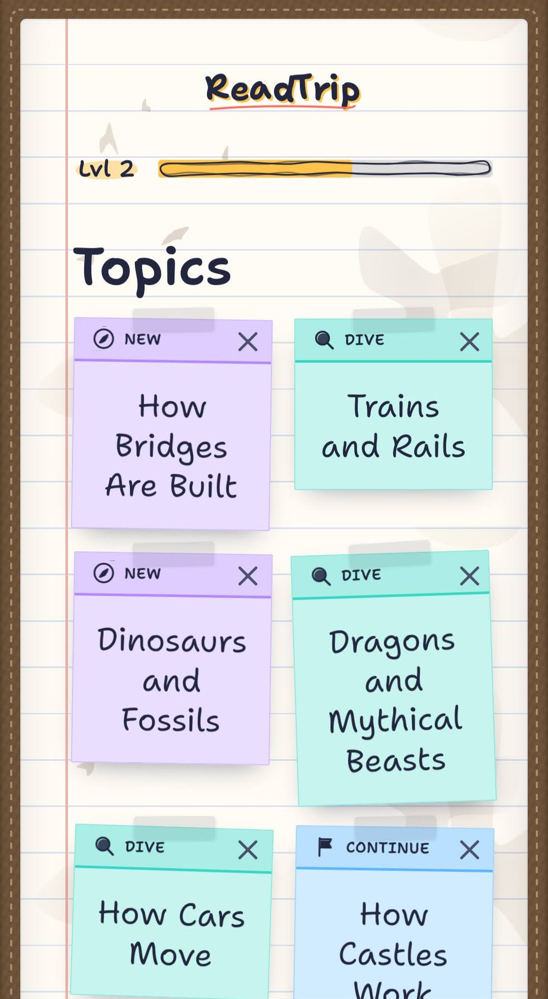
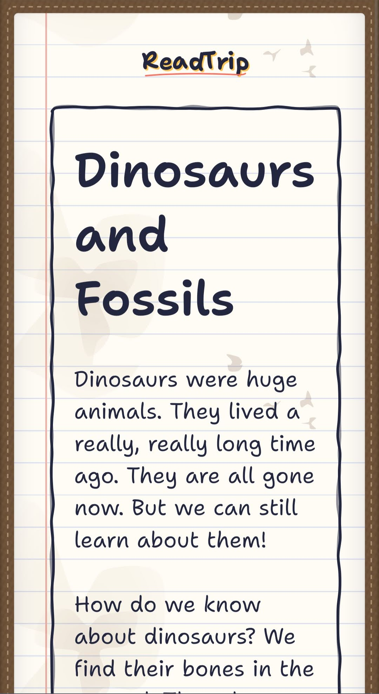
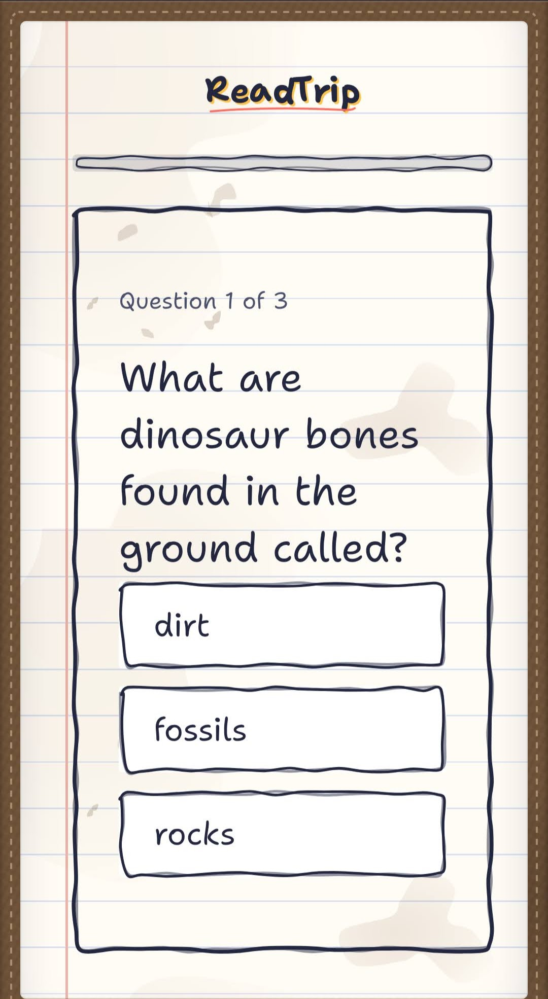

# ReadTrip — a curiosity engine for kids

ReadTrip is a web app that lets a child (**ages ~5–12**) dive into any topic they're
curious about. The same product spans early readers and tweens by adapting reading level
rather than shipping separate apps. Under the hood it runs on advanced, production-grade
LLM integration — adaptive content generation, model routing, prompt caching, and evals —
to serve **engaging, age-appropriate explanations**, check understanding with **quizzes**,
let the child **steer where to explore next**, and wrap the whole loop in **gamification**
(points, levels, a world map of knowledge, and badges for mastering topics).

https://readtripapp.vercel.app/

## Design: a young explorer's field journal

ReadTrip isn't skinned in generic primary-color "kids app" clip-art. The whole product is
one surface — a hand-written science explorer's **field journal** on warm lined paper. Topics
are sticky notes taped to the page, containers are hand-drawn "pen boxes" (not rounded rects),
progress is a highlighter swipe or an ink stamp, and every word is set in one handwritten
voice (Shantell Sans). It's a real design system, not a theme: tokenized colors (all pairings
meet WCAG AA), a shared component library, and one paper surface that reading, quizzes, and
the topic map all live on. Details in [`docs/10-design-system.md`](docs/10-design-system.md).

<table>
  <tr>
    <td align="center" width="33%">
      
      <br />
      <sub><b>Explore</b> — pick a topic</sub>
    </td>
    <td align="center" width="33%">
      
      <br />
      <sub><b>Read</b> — a lesson on lined paper</sub>
    </td>
    <td align="center" width="33%">
      
      <br />
      <sub><b>Quiz</b> — check understanding</sub>
    </td>
  </tr>
</table>

## The core loop

```
Calibrate → Explore → Read → Quiz → Reward → Steer → (back to Explore)
   ↑ once         ↑ adaptive difficulty           ↑ child picks next topic
```

1. **Calibrate** — a short, fun mini-game estimates the child's reading level (one time, then continuously refined).
2. **Explore** — the child names a topic, or picks from a dynamically generated map of branches.
3. **Read** — the LLM produces a kid-friendly explanation at the child's level.
4. **Quiz** — 2–4 questions check comprehension.
5. **Reward** — points + XP for reading and correct answers; badges for topic mastery.
6. **Steer** — the child chooses where to go next; difficulty adapts from quiz results.

## Key features

- **Adaptive difficulty.** A calibration mini-game sets a starting reading level, then
  quiz results continuously refine it — a real calibration + online-adaptation problem,
  not just a prompt trick. Kids' reading levels vary wildly, and getting this right
  requires measurement, not guesswork.
- **Model routing + prompt caching.** Generation is routed across Haiku/Sonnet/Opus by
  task, and stable system prompts are cached — keeping cost and latency low even as
  content is generated at scale.
- **Evals.** Reading-level accuracy, quiz quality, and factual grounding are measured, not
  assumed — a versioned eval harness verifies the product actually works as intended.
- **Child safety, end to end.** This is a product **for children**, so safety is a
  first-class concern, not an afterthought. Every path that generates or surfaces content
  is guarded, and every guardrail runs **server-side** (the Claude API key never reaches
  the browser):
  - **Layered guardrails, defense in depth.** A free, deterministic **rules layer**
    catches obvious cases before spending a model call; a **Haiku classifier** handles
    nuance on free-form input. The generation **system prompts** are the primary defense;
    a lightweight **output scan** is the backstop on everything the model produces.
  - **Every generation path is covered — input _and_ output:**
    - **Explore** — free-form topic input is prechecked before anything is generated.
    - **Read (lesson)** — the topic is re-checked (defense in depth), and the streamed
      lesson is **output-scanned as it streams**: an unsafe fragment is withheld, never
      sent, and the whole lesson is replaced with a gentle redirect.
    - **Quiz** — the generated quiz (every prompt, choice, and explanation) is scanned
      before it's shown or persisted; an unsafe quiz is dropped, not stored.
    - **World-map suggestions** — the map's topic suggestions are LLM output too, so they
      pass the **same guardrails** before a single node is saved or displayed.
  - **Redirect, don't scold.** A blocked topic gets a warm "let's explore something else"
    steer — never a cold error or a lecture. Struggling or curiosity is never punished.
  - **Auditable.** Every safety-relevant model call is logged (`LlmCallLog`) so decisions
    can be reviewed and tuned.

The rationale and the red-team eval plan live in
[`docs/07-evals-and-safety.md`](docs/07-evals-and-safety.md); the guardrail code is in
[`lib/safety/`](lib/safety).

## Stack

Next.js (App Router) + TypeScript, with the Claude API for all generation. See
[`docs/02-architecture.md`](docs/02-architecture.md).

## Documentation

| Doc                                                                | What's in it                                                |
| ------------------------------------------------------------------ | ----------------------------------------------------------- |
| [`docs/01-product-spec.md`](docs/01-product-spec.md)               | Vision, principles, the core loop in detail                 |
| [`docs/02-architecture.md`](docs/02-architecture.md)               | Next.js structure, data flow, request lifecycle             |
| [`docs/03-llm-integration.md`](docs/03-llm-integration.md)         | Models, pricing, **model routing**, prompt caching, prompts |
| [`docs/04-reading-levels.md`](docs/04-reading-levels.md)           | Calibration mini-game + ongoing adaptation                  |
| [`docs/05-gamification.md`](docs/05-gamification.md)               | Points, levels, the knowledge world map, badges             |
| [`docs/06-data-model.md`](docs/06-data-model.md)                   | Database schema                                             |
| [`docs/07-evals-and-safety.md`](docs/07-evals-and-safety.md)       | Evals, guardrails, observability — the differentiators      |
| [`docs/08-roadmap.md`](docs/08-roadmap.md)                         | Phased build plan (MVP → grounding → polish)                |
| [`docs/09-implementation-plan.md`](docs/09-implementation-plan.md) | Milestone-by-milestone engineering checklist (M0–M6)        |
| [`docs/10-design-system.md`](docs/10-design-system.md)             | Kid-friendly, accessible design system + component library  |
